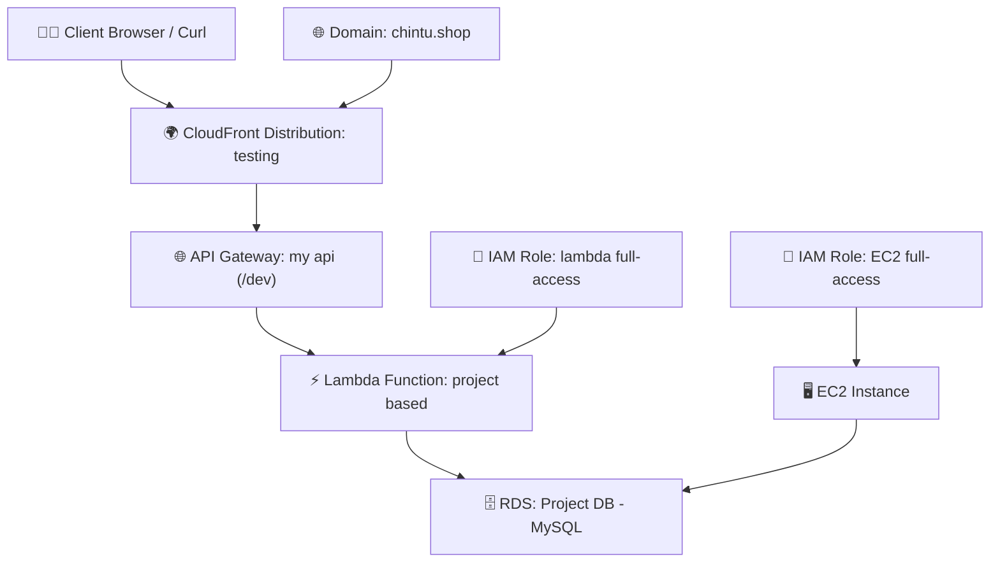

# 🚀 Project Setup with AWS RDS, IAM, Lambda, API Gateway & CloudFront  

## 1️⃣ RDS  
- Create database  
- Name – **Project DB**  
- Engine – **MySQL**  
- Templates – **Free tier**  
- Public access – **Yes**  
- Choose existing VPC security group – **default**  
- Availability zone – **us-east-1**  
- ✅ Click **Create database**  

---

## 2️⃣ IAM Role (Lambda)  
- Use case – **lambda**  
- Select role – **Administrator Access**  
- Role name – **lambda full-access**  
- ✅ Click **Create**  

---

## 3️⃣ Lambda  
- Create function  
- Name – **project based**  
- Runtime – **Python 3.13**  
- Change execution role – **existing role**  
- ✅ Click **Create**  

### 📂 Layers  
- Go to **Layer** → Click → **Add layer**  
  - Select **API Gateway**  
  - Create new layer → Name – **Dev**  
  - Upload a zip-file → **Upload**  
  - Runtime – **Python 3.13**  
  - ✅ Save  

- Then go to **Layer option**  
  - Add layer → **Custom layer (select)** → Create  

### ⚙️ Configuration  
- Extend Lambda timeout → **10 min**  

---

## 4️⃣ IAM Role (EC2)  
- IAM role → Use case – **EC2**  
- Select role – **Administrator Access**  
- Role name – **lambda full-access**  
- ✅ Click **Create**  

### 🖥️ Launch EC2 Instance  
- Default SG, VPC, Subnet & AZ  

---

## 5️⃣ Connect EC2  
```bash
sudo su
yum install mariadb105-server

# Connect to RDS
mysql -h <database endpoint> -u admin -p

# Create and use database
CREATE DATABASE dev;
USE dev;

# Create table
CREATE TABLE user_accounts (
    id INT AUTO_INCREMENT PRIMARY KEY,
    full_name VARCHAR(100) NOT NULL,
    email VARCHAR(150) NOT NULL UNIQUE,
    password_hash VARCHAR(255) NOT NULL,
    created_at DATETIME DEFAULT CURRENT_TIMESTAMP,
    welcome_message TEXT,
    is_verified BOOLEAN DEFAULT FALSE,
    profile_theme VARCHAR(50)
);
```

### 📊 Table Schema  

| Column Name      | Data Type       | Description                                      |
|------------------|-----------------|--------------------------------------------------|
| id               | INT (PK)        | Unique user ID (auto-incremented)                |
| full_name        | VARCHAR(100)    | User’s full name                                 |
| email            | VARCHAR(150)    | Email address (must be unique)                   |
| password_hash    | VARCHAR(255)    | Securely hashed password                         |
| created_at       | DATETIME        | Timestamp of account creation                    |
| welcome_message  | TEXT            | Custom message shown after registration          |
| is_verified      | BOOLEAN         | Email verification status                        |
| profile_theme    | VARCHAR(50)     | UI theme preference (e.g., “glassmorphism”)      |

---

## 6️⃣ Lambda Configuration  
- Go to **Configuration** → Select **VPC** → Edit  
  - VPC – default  
  - Subnet – default  
  - AZ – default  
  - SG – default  

- Edit **environmental variables**  

📂 Code enters:  
- **backend file** (create new event & test code)  
- **Index file**  
- **Success file**  

---

## 7️⃣ API Gateway  
- Create API → Select **REST API – Build**  
- API name – **my api**  
- ✅ Click **Create**  

### Methods  
- **GET Method**  
  - Lambda function → **lambda proxy integration** → ON  
  - Choose the lambda function  
  - ✅ Create method  

- **POST Method**  
  - Lambda function → **lambda proxy integration** → ON  
  - Choose the lambda function  
  - ✅ Create method  

### Deployment  
- Stage – **new stage**  
- Stage name – **dev**  
- ✅ Deploy  

- Copy **Invoke URL** → Paste into search bar  

---

## 8️⃣ CloudFront  
- Create distribution → Name – **testing** → Next  
- Go to **Origin** → Origin – **API Gateway**  
  - Select API – **REST API (existing)**  
  - Origin path – `/dev` → Next  

- Web-Application Firewall (WAF) → Select **Do not enable security protection** → Next  
- Description value – show → ✅ Create distribution  

- After some time → CloudFront endpoint available → Copy endpoint → Paste into search bar  

---

## 9️⃣ Domain Setup  
- Go to **Settings option** → Domain name option  
- Add domain → Name – **chintu.shop**  
- Select certificate – **automatic select** → Next  
- Click domain to CloudFront option (automatic A type record method created)  
- Go to search bar → Domain name search  

---





---

---


